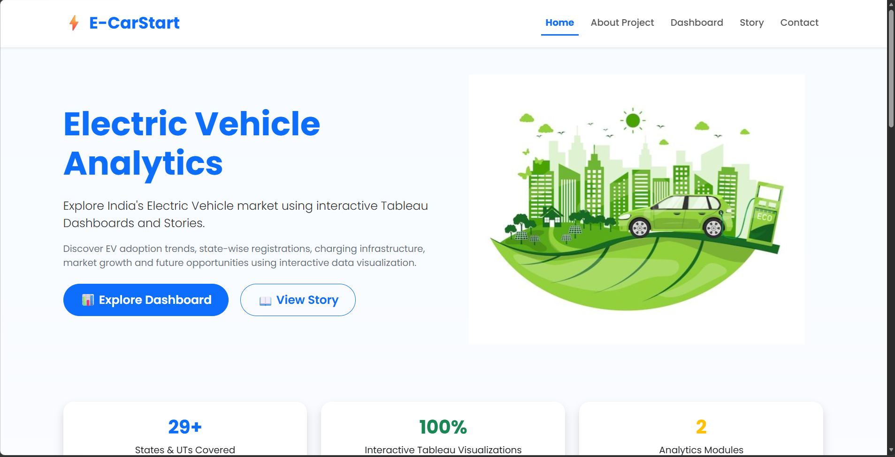
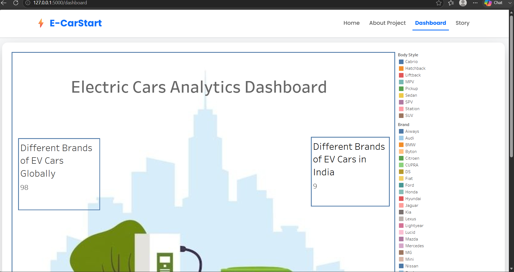
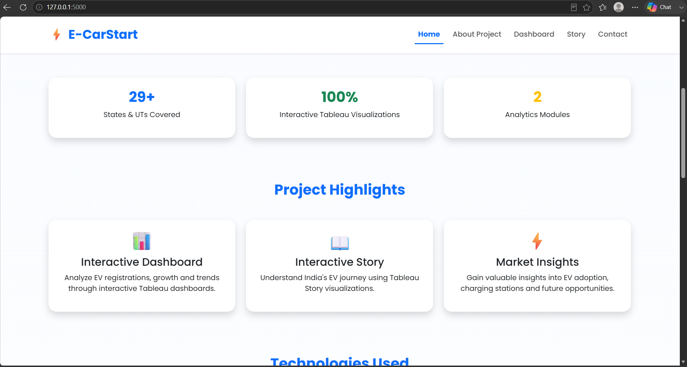

<div align="center">

# ⚡ E-CarStart

### 🚗 Electric Vehicle Analytics using Flask & Tableau

An interactive web application that visualizes and analyzes **Electric Vehicle (EV)** data across India using **Python Flask** and **Tableau Public**.

---


</div>

---

# 📌 Project Overview

**E-CarStart** is a Flask-based web application developed to visualize and analyze India's **Electric Vehicle (EV)** ecosystem through interactive dashboards and stories.

The project integrates **Tableau Public** with **Flask** to provide meaningful insights into:

- 📈 EV Registration Trends
- 🚗 Vehicle Categories
- 🏭 Manufacturer Performance
- 📍 State-wise EV Adoption
- 📊 Interactive Data Visualization

---

# 📸 Application Preview

## 🏠 Home Page

<p align="center">

</p>

---

## 📊 Dashboard

<p align="center">

</p>

---

## 📖 Story

<p align="center">

</p>

---

## ℹ️ About Page

<p align="center">

</p>

---

# ✨ Features

| Feature | Description |
|----------|-------------|
| 🏠 Home Page | Responsive landing page |
| 📊 Dashboard | Interactive Tableau Dashboard |
| 📖 Story | Interactive Tableau Story |
| 📈 EV Analytics | Registration trend analysis |
| 🚗 Vehicle Insights | Vehicle category analysis |
| 🏭 Manufacturer Analysis | Brand-wise EV performance |
| 📍 State Analysis | State-wise EV adoption |
| 📱 Responsive UI | Mobile-friendly interface |
| ⚡ Modern Design | Clean and intuitive user interface |

---

# 📊 Dashboard Highlights

The dashboard enables users to explore:

- 📈 EV Registration Trends
- 🏭 Manufacturer-wise Performance
- 🚗 Vehicle Category Distribution
- 📍 State-wise EV Adoption
- 📅 Year-wise Growth Analysis
- 🎛️ Interactive Filters and Visualizations

---

# 🛠️ Technology Stack

| Technology | Purpose |
|------------|---------|
| 🐍 Python | Backend Development |
| 🌐 Flask | Web Framework |
| 🎨 HTML5 | Web Structure |
| 🎨 CSS3 | Styling |
| ⚡ Bootstrap 5 | Responsive Design |
| 📊 Tableau Public | Interactive Dashboards |
| 🐙 Git & GitHub | Version Control |

---

# 📂 Project Structure

```text
TableauFlaskProject/
│
├── app.py
├── requirements.txt
├── README.md
│
├── static/
│   ├── css/
│   └── images/
│
├── templates/
│   ├── index.html
│   ├── dashboard.html
│   ├── story.html
│   └── about.html
│
├── Screenshots/
│   ├── Home.png
│   ├── Dashboard.png
│   ├── Story page.png
│   └── About.png
│
├── data/
│
├── 1. Ideation Phase/
├── 2. Requirement Analysis/
├── 3. Project Design Phase/
├── 4. Project Planning Phase/
├── 5. Project Development Phase/
├── 6. Performance Testing Phase/
└── 7. Project Documentation/
```

---

# 🚀 Installation

### Clone the Repository

```bash
git clone https://github.com/nharshitha19/TableauFlaskProject.git
```

### Navigate to the Project

```bash
cd TableauFlaskProject
```

### Install Dependencies

```bash
python -m pip install -r requirements.txt
```

### Run the Application

```bash
python app.py
```

Open your browser and visit:

```text
http://127.0.0.1:5000
```

---

# 📄 Project Modules

### 🏠 Home

- Project Overview
- Technology Stack
- Navigation Menu
- Project Highlights

### 📊 Dashboard

Interactive Tableau dashboard for EV analytics.

### 📖 Story

Interactive Tableau Story presenting key findings and insights.

### ℹ️ About

Project objectives, technologies used, and developer details.

---

# 🎯 Project Objectives

- Build an interactive EV analytics platform.
- Integrate Tableau Public with Flask.
- Develop a responsive web application.
- Present insights through interactive dashboards.
- Improve data-driven decision making using visualization.

---

# 🔗 Project Links

## 📂 GitHub Repository

👉 **https://github.com/nharshitha19/TableauFlaskProject**

## 📊 Tableau Public Profile

👉 **https://public.tableau.com/app/profile/harshitha.narahari**

## 📈 Tableau Dashboard

👉 **https://public.tableau.com/app/profile/harshitha.narahari/viz/Ev_dashboard_17840050687600/ElectricCarsAnalyticsDashboard**

## 📖 Tableau Story

👉 **https://public.tableau.com/app/profile/harshitha.narahari/viz/Ev_story/StoryofelectriccarsinIndia**

---

# 🔮 Future Enhancements

- 🔐 User Authentication
- ☁️ Cloud Deployment
- 📡 Real-Time EV Data
- 🤖 AI-based EV Prediction
- 📥 Export Reports
- 📱 Progressive Web Application (PWA)

---

# 🎓 Learning Outcomes

- Flask Web Development
- Tableau Dashboard Development
- Interactive Data Visualization
- Responsive UI Design
- Python–Tableau Integration
- Git & GitHub Version Control

---

# 📌 Project Status

✅ Completed

✅ Documentation Completed

✅ Tableau Dashboard Published

✅ Tableau Story Published

✅ Flask Integration Completed

---

# 👩‍💻 Developed By

## **Harshitha Narahari**

🎓 Bachelor of Engineering (Computer Science)

💻 Python • Flask • Tableau • Data Analytics

---

<div align="center">

## ⭐ Support

If you found this project useful, please consider giving it a **⭐ Star** on GitHub.

---

### Made with using Python, Flask & Tableau

</div>

---

# 📄 License

This project is developed for **academic and educational purposes**.
